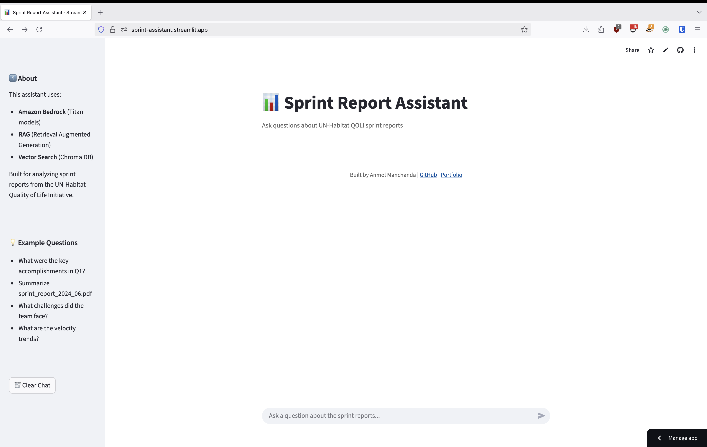
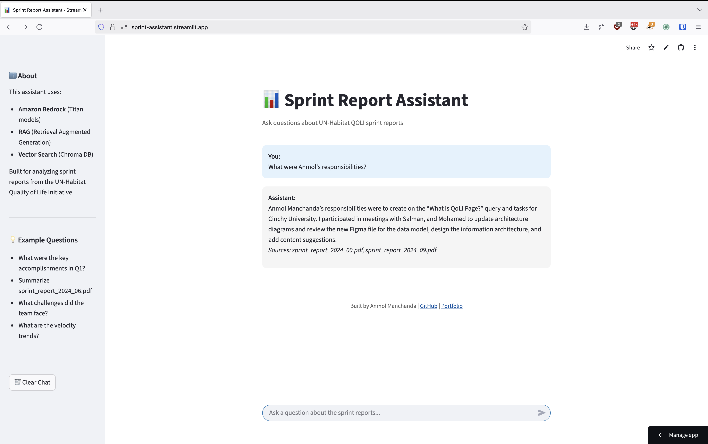
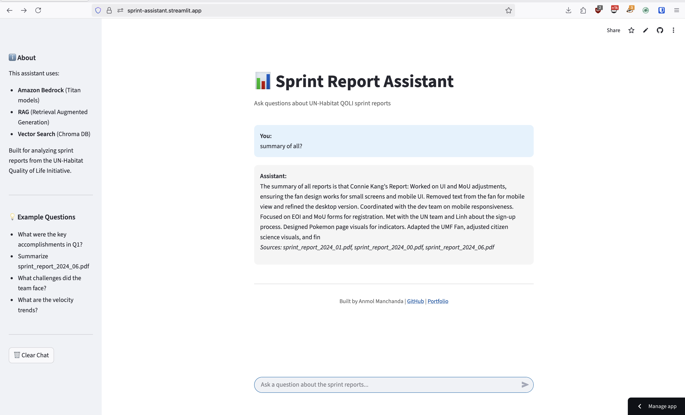

# Sprint Report Assistant

AI chatbot for analyzing UN-Habitat QOLI sprint reports using Amazon Bedrock.

<div align="center">

</div>

## What it does

Semantic search across sprint reports using RAG (Retrieval Augmented Generation). Ask questions about the project, team responsibilities, or get summaries of specific reports.

<div align="center">

</div>

## Tech Stack

- **Amazon Bedrock** - Titan embeddings + text models
- **ChromaDB** - Vector database for semantic search
- **Streamlit** - Web interface
- **Python 3.11+**

<div align="center">

</div>

## Setup

1. Install dependencies:
```bash
pip install -r requirements.txt
```

2. Add your AWS credentials to `.env`:
```bash
AWS_ACCESS_KEY_ID=your_key
AWS_SECRET_ACCESS_KEY=your_secret
AWS_REGION=us-east-1
```

3. Add PDF reports to `data/` folder

4. Generate embeddings:
```bash
python src/embeddings.py
```

5. Run the app:
```bash
streamlit run app.py
```

## Architecture
```
Query → Vector Search → Retrieve Context → Bedrock → Answer + Citations
```

The agent has one tool: `summarize_report()` for focused report summaries.

## Example Queries

- "What were Anmol's responsibilities?"
- "What challenges did the team face?"
- "Summarize sprint_report_2024_06.pdf"

## Deployment

See [docs/DEPLOYMENT.md](docs/DEPLOYMENT.md) for Streamlit Cloud setup.

## License

MIT
